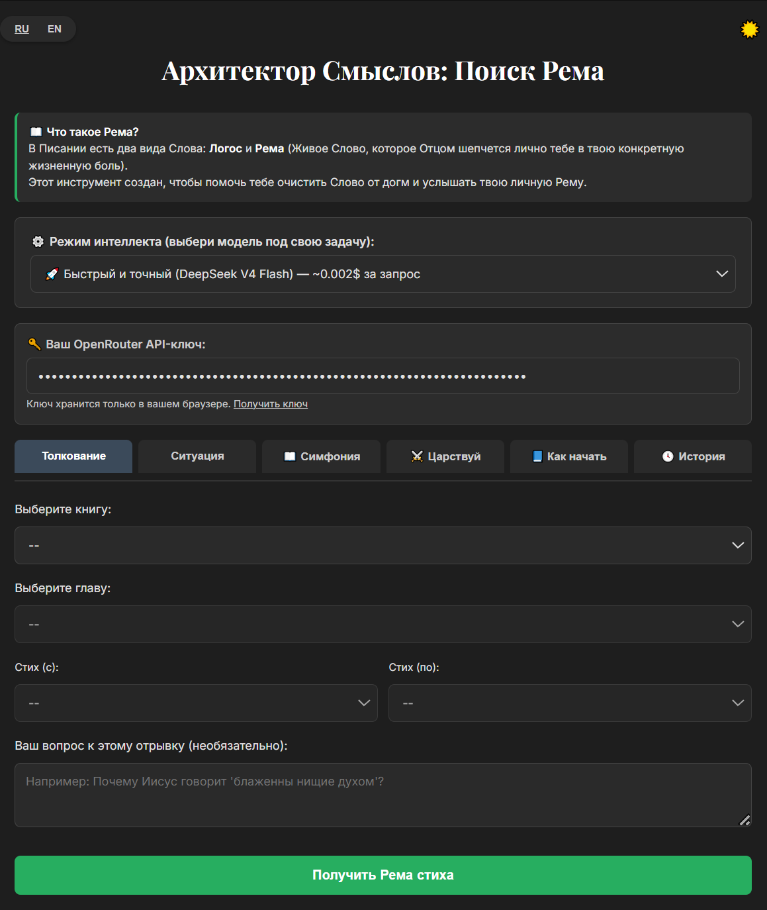

# 📖 Архитектор Смыслов — инструкция по запуску

**Архитектор Смыслов** — это локальное веб-приложение для глубокого анализа библейских текстов с помощью искусственного интеллекта. Оно работает через OpenRouter и поддерживает три модели DeepSeek: V4 Flash, V3.2 и R1.


*Главный экран Архитектора Смыслов*

## 🚀 Быстрый старт (для Windows, macOS, Linux)

### 1. Установите Node.js
Перейдите на официальный сайт [nodejs.org](https://nodejs.org) и скачайте **LTS-версию**. Установите её как обычную программу, со всеми галочками по умолчанию.

### 2. Скачайте и распакуйте проект
* **[Скачать ZIP-архив проекта (Жми сюда)]([https://github.com](https://github.com/TruthCode-hash/architect-of-meanings/releases/download/v1.0.0/architect-v1.0.0.zip))** и распакуйте его в любую удобную папку (например, `C:\Architect` для Windows).
* *(Для разработчиков)* Можно клонировать через Git: `git clone https://github.com`

### 3. Откройте терминал в папке проекта
* **Для Windows (Самый простой способ):** Зайдите в папку с распакованным проектом. Кликните мышкой по адресной строке вверху проводника (там, где написан путь к папке), сотрите всё, напишите английскими буквами `cmd` и нажмите **Enter**.
* **Альтернатива для Windows:** Зажмите клавишу `Shift`, щёлкните правой кнопкой мыши по пустому месту внутри папки и выберите «Открыть окно PowerShell здесь».
* **Для macOS/Linux:** Откройте Terminal и перейдите в папку через команду `cd путь/к/папке`.

### 4. Установите зависимости и запустите
В открывшемся окне терминала введите команду для установки:
```bash
npm install
```
Дождитесь завершения установки (обычно меньше минуты).

### 5. Запустите сервер
Затем введите команду запуска:
```bash
node server.js
```
Вы увидите сообщение:
```
📖 Библия загружена (66 книг)
✅ Сайт запущен: http://localhost:3000
```
Браузер должен автоматически открыть страницу приложения. Если этого не произошло, откройте вручную адрес **http://localhost:3000**.

### 6. Настройте приложение
1. Вставьте ваш **OpenRouter API-ключ** в соответствующее поле.  
   Если у вас его нет, зарегистрируйтесь на [openrouter.ai](https://openrouter.ai), пополните баланс и создайте ключ.
2. Выберите модель ИИ (рекомендуем начать с DeepSeek V4 Flash).
3. Перейдите на вкладку **«Толкование»** или **«Ситуация»**.
4. Выберите книгу, главу и диапазон стихов (или опишите свою ситуацию).
5. Нажмите кнопку получения ответа и подождите около минуты — ИИ проведёт глубокий анализ.

### 7. Остановка сервера
Чтобы остановить работу приложения, вернитесь в окно терминала и нажмите **Ctrl+C**. После этого страница перестанет отвечать.

---

## ❓ Частые проблемы
**Сервер не запускается, ошибка «node не является командой»**  
Значит, Node.js не установлен или не добавлен в PATH. Переустановите Node.js, отметив галочку «Add to PATH» при установке.

**Ошибка «Файл bible-ru.json не найден»**  
Убедитесь, что файл `bible-ru.json` лежит в одной папке с `server.js`.

**Ошибка «Пожалуйста, введите ваш OpenRouter API-ключ»**  
Вы не ввели ключ на странице. Вставьте его в поле и повторите запрос.

**Долго отвечает или ошибка соединения**  
Модель DeepSeek R1 может думать дольше минуты. Попробуйте подождать ещё или выберите более быструю модель (V4 Flash).

**Браузер не открылся автоматически**  
Просто вручную перейдите по адресу [http://localhost:3000](http://localhost:3000).

---

### 🔒 О безопасности
Ваш API-ключ хранится только в вашем браузере (localStorage) и не передаётся никому, кроме OpenRouter. Сервер не сохраняет никакие данные о запросах.

---

### 📦 Что входит в проект
- `server.js` — локальный веб-сервер.
- `public/index.html` — интерфейс приложения.
- `bible-ru.json` — текст Библии.
- `package.json` — список зависимостей.
- `README.md` — эта инструкция.


