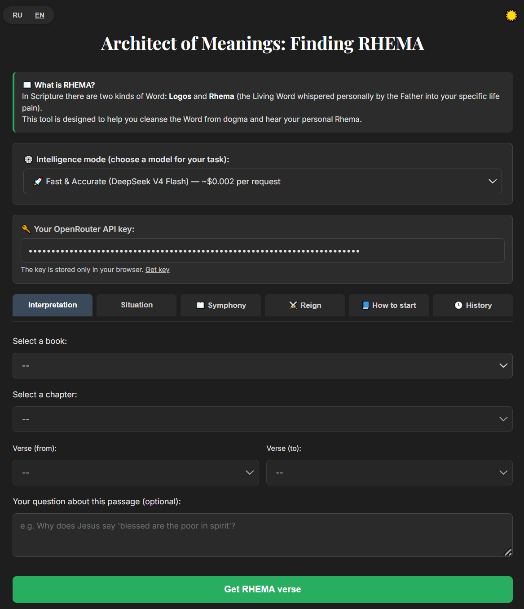

# 🇷🇺 ИНСТРУКЦИЯ НА РУССКОМ ЯЗЫКЕ / RUSSIAN MANUAL
> **Программа полностью двуязычная (РУС / ENG) и имеет встроенный переключатель интерфейса на русский язык.**
> 
> 👉 **[НАЖМИ СЮДА, ЧТОБЫ ЧИТАТЬ ИНСТРУКЦИЮ НА РУССКОМ](./README-RU.md)**
---
# 📖 Architect of Meanings — Launch Instructions

**Architect of Meanings** is a local web application for deep analysis of biblical texts using artificial intelligence. It works through OpenRouter and supports three DeepSeek models: V4 Flash, V3.2, and R1.


*The Architect of Meanings Home Screen*

## 🚀 Quick Start (for Windows, macOS, Linux)

### 1. Install Node.js

Go to the official website [nodejs.org](https://nodejs.org) and download the **LTS version** (recommended). Install it like a normal program.

### 2. Download and unpack the project

If you received the archive `architect-of-meanings.zip`, unpack it into any convenient folder (for example, `C:\Architect` or `~/architect`).

If you use Git, run:

```bash
git clone https://github.com/YOUR_LOGIN/architect-of-meanings.git
cd architect-of-meanings
```

### 3. Place the Bible file

In the root folder of the project there should be the file **`bible-ru.json`** — this is the text of the Bible in JSON format. If you do not see it, download it separately and put it in the same folder where `server.js` is located.

### 4. Install dependencies

Open a terminal (command line) in the project folder:

- **Windows:** hold `Shift`, right-click on an empty space in the folder, select "Open PowerShell window here".
- **macOS/Linux:** open Terminal and navigate to the folder using `cd path/to/folder`.

Run the command:

```bash
npm install
```

Wait for the installation to complete (usually less than a minute).

### 5. Start the server

In the same terminal window run:

```bash
node server.js
```

You will see the message:

```
📖 Bible loaded (66 books)
✅ Site running: http://localhost:3000
```

The browser should automatically open the application page. If not, manually go to **http://localhost:3000**.

### 6. Configure the application

1. Insert your **OpenRouter API key** into the corresponding field.  
   If you don't have one, register at [openrouter.ai](https://openrouter.ai), top up your balance, and create a key.
2. Select an AI model (we recommend starting with DeepSeek V4 Flash).
3. Go to the **"Interpretation"** or **"Situation"** tab.
4. Select a book, chapter, and range of verses (or describe your situation).
5. Click the button to get the answer and wait about a minute — the AI will perform a deep analysis.

### 7. Stopping the server

To stop the application, return to the terminal window and press **Ctrl+C**. After that the page will stop responding.

---

## ❓ Common issues

**Server does not start, error "node is not a command"**  
Node.js is not installed or not added to PATH. Reinstall Node.js, checking "Add to PATH" during installation.

**Error "File bible-ru.json not found"**  
Make sure the file `bible-ru.json` is in the same folder as `server.js`.

**Error "Please enter your OpenRouter API key"**  
You did not enter the key on the page. Insert it into the field and try again.

**Takes a long time or connection error**  
The DeepSeek R1 model can think for more than a minute. Try waiting longer or choose a faster model (V4 Flash).

**Browser did not open automatically**  
Just manually go to [http://localhost:3000](http://localhost:3000).

---

## 🔒 About security

Your API key is stored only in your browser (localStorage) and is not transferred to anyone except OpenRouter. The server does not save any request data.

---

## 📦 What is included in the project

- `server.js` — local web server.
- `public/index.html` — application interface.
- `bible-en.json` — Bible text.
- `package.json` — dependency list.
- `README.md` — these instructions.
